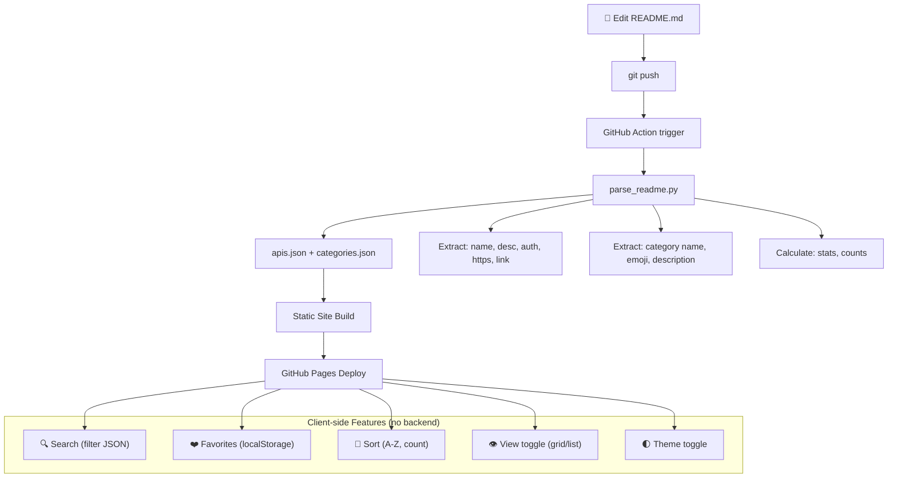

# 🔍 API Directory Design Inspiration Research

> Phân tích các trang API directory phổ biến, tổng hợp features hay để áp dụng cho Awesome Free APIs.

---

## Screenshots các trang tham khảo

````carousel

<!-- slide -->

<!-- slide -->

<!-- slide -->

````

---

## 1. So sánh tính năng

| Feature | APILayer | public-apis.io | RapidAPI | **Mình (hiện tại)** | **Nên thêm?** |
|:---|:---:|:---:|:---:|:---:|:---:|
| 🔍 Search APIs | ✅ | ✅ | ✅ (⌘K) | ✅ basic | ✅ **Nâng cấp** |
| 📂 Category filter sidebar | ✅ checkbox | ✅ tag cloud | ✅ sidebar | ✅ sidebar | ✅ OK rồi |
| ⭐ Rating/Stars | ✅ 5-star | ❌ | ✅ | ❌ | ⚠️ Khó từ README |
| 📊 Popularity/Usage count | ❌ | ❌ | ✅ | ❌ | ⚠️ Khó từ README |
| 🏷️ Auth badge (No/Key/OAuth) | ❌ | ✅ | ❌ | ✅ | ✅ Đã có |
| 🔒 HTTPS indicator | ❌ | ✅ | ❌ | ✅ | ✅ Đã có |
| 💰 Pricing info | ✅ Free/Paid | ❌ | ✅ tiers | ❌ | ❌ Không cần (mình free) |
| ❤️ Favorites/Bookmarks | ❌ | ✅ | ✅ | ❌ | ✅ **Nên thêm** |
| 🔄 Sort (A-Z, Latest, Featured) | ✅ | ❌ | ✅ | ❌ | ✅ **Nên thêm** |
| 👁️ Grid/List view toggle | ✅ | ❌ | ❌ | ❌ | ✅ **Nên thêm** |
| 📝 Category description | ❌ | ❌ | ✅ | ❌ | ✅ **Nên thêm** |
| 🌓 Dark/Light toggle | ❌ | ❌ | ✅ | ❌ (dark only) | ✅ **Nên thêm** |
| 📰 Blog/News | ❌ | ✅ | ❌ | ❌ | ❌ Không cần |
| 🏠 Featured APIs section | ❌ | ✅ | ✅ | ❌ | ✅ **Nên thêm** |
| 📱 Responsive/Mobile | ❌ (min 1300px) | ✅ | ✅ | ✅ | ✅ Bắt buộc |
| 🔗 API detail page | ✅ full page | ✅ | ✅ full page | ❌ | ⚠️ Optional |

---

## 2. Features HAY nhất từ mỗi trang

### 🏆 APILayer — Cái hay nhất: **Filter + Sort UX**
- **Sidebar checkbox filter** — click category → filter realtime, không reload page
- **Sort dropdown** (Featured / A-Z / Latest) — rất hữu ích
- **Grid/List toggle** — user chọn view preference
- **"View API" button** mỗi card → CTA rõ ràng

> **Áp dụng cho mình**: Filter + Sort + View toggle → hoàn toàn làm được từ JSON data, không cần thêm gì vào README

### 🏆 public-apis.io — Cái hay nhất: **Tag Cloud Navigation**
- **Category tags** dạng pill/chip — hiển thị TẤT CẢ categories trên 1 màn hình
- **Favourites** — lưu API yêu thích vào localStorage
- **Search placeholder** gợi ý: "Music, Movie, Games, Development..."

> **Áp dụng cho mình**: Tag cloud + Favourites (localStorage, zero backend) → dễ implement

### 🏆 RapidAPI — Cái hay nhất: **Content Richness**
- **Category cards có mô tả** — "Cybersecurity APIs offer tools for developers to bolster..."
- **Featured sections** — "Top Categories", "Best For Daily Routine", "Recently Added"
- **⌘K search** — spotlight-style search modal
- **Dark/Light toggle**

> **Áp dụng cho mình**: Category descriptions + Featured section + Theme toggle

---

## 3. Cái gì KHÔNG thể lấy từ README?

| Feature | Lấy từ README? | Giải pháp |
|:---|:---:|:---|
| API name, description, auth, HTTPS, link | ✅ Có | Parse table rows |
| Category name + emoji | ✅ Có | Parse `## 🐾 Animals` headers |
| API count per category | ✅ Có | Count table rows |
| ⭐ Rating/Stars | ❌ Không | Cần database/backend riêng |
| 📊 Popularity | ❌ Không | Cần analytics tracking |
| 📝 Category description | ⚠️ Chưa có | **Thêm vào README** (1 dòng dưới header) |
| 🏷️ Tags per API | ⚠️ Chưa có | Có thể thêm column hoặc auto-tag |
| 🕐 Date added | ⚠️ Chưa có | Có thể lấy từ git history |
| ❤️ Favourites | ✅ Client-side | localStorage, zero backend |

> [!IMPORTANT]
> **Kết luận**: ~90% features có thể lấy từ README. Chỉ rating/popularity cần backend riêng — nhưng không cần thiết cho một curated list.

---

## 4. 🎯 Feature Roadmap cho Web mới

### Tier 1 — MVP (parse từ README, zero backend)
- [x] Category grid với emoji + count
- [x] API table/cards per category
- [x] Auth badges (No Auth / API Key / OAuth)
- [x] HTTPS indicator
- [x] Search (client-side, filter từ JSON)
- [ ] **Sort** (A-Z, Category count)
- [ ] **Grid/List view toggle**
- [ ] **Dark/Light theme toggle**

### Tier 2 — Enhanced UX (vẫn từ README)
- [ ] **⌘K Spotlight search** (Raycast-style modal)
- [ ] **Category tag cloud** (quick filter pills)
- [ ] **Featured APIs section** (curated, hardcode trong config)
- [ ] **Category descriptions** (thêm 1 dòng vào README)
- [ ] **Responsive mobile layout**
- [ ] **Scroll animations** (fade-in cards, count-up stats)

### Tier 3 — Nice-to-have (cần thêm logic)
- [ ] **❤️ Favorites** (localStorage)
- [ ] **Recently added** (parse git history)
- [ ] **Random API** button (surprise me!)
- [ ] **Copy API URL** button
- [ ] **Status badge** (integrate với link-checker data)
- [ ] **Share API** (Twitter/LinkedIn deeplink)

### Tier 4 — Future (cần backend)
- [ ] ⭐ User ratings
- [ ] 💬 Comments/Reviews
- [ ] 📊 Usage analytics
- [ ] 🤖 AI search ("find me a free weather API with no auth")

---

## 5. 📝 README Changes Needed

Để hỗ trợ web mới tốt hơn, chỉ cần thêm **1 thay đổi nhỏ** vào README:

```diff
 ## 🐾 Animals
+
+> APIs related to animals, pets, and wildlife data.
 
 | API Name | Description | Auth | HTTPS | Link |
```

Thêm 1 dòng blockquote mô tả category → parser sẽ extract làm category description cho web.

**Ngoài ra không cần thay đổi gì khác** — format table hiện tại đã đủ data cho tất cả Tier 1-3 features.

---

## 6. Pipeline Architecture (Updated)



> [!TIP]
> **Tất cả interactive features (search, sort, filter, favorites, theme) đều chạy client-side** — không cần backend, không cần database. Chỉ cần 1 file `apis.json` được parse từ README.
