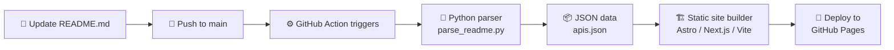

# 🎨 Awesome Free APIs — Website Design Brief

> **Mục tiêu**: Thiết kế web đẹp premium-grade, tự động cập nhật từ README.md qua GitHub Actions pipeline.

---

## Design Mockups

````carousel

<!-- slide -->

````

---

## 1. 🎯 Design Philosophy

**Aesthetic**: Premium Developer Tool — nghĩ đến **Linear.app**, **Vercel Dashboard**, **Raycast**

| Keyword | Mô tả |
|---|---|
| **Dark-first** | Nền tối deep navy, không phải đen thuần |
| **Glassmorphism** | Cards với blur background + border subtle |
| **Depth** | Subtle shadows, layered surfaces |
| **Motion** | Micro-animations mượt, hover effects sống động |
| **Data-rich** | Stats nổi bật, badges màu sắc rõ ràng |

**KHÔNG làm**: Generic docs site, plain table dump, basic white theme

---

## 2. 🎨 Color System

### Primary Palette (Dark Mode)

```
Background Layers:
  --bg-base:      #06080f    ← Deepest layer
  --bg-surface:   #0d1117    ← Cards, panels
  --bg-elevated:  #161b22    ← Modals, dropdowns
  --bg-hover:     #1c2333    ← Hover states

Accent Colors:
  --accent-blue:    #3b82f6  ← Primary actions, links
  --accent-purple:  #8b5cf6  ← Featured items, gradients
  --accent-cyan:    #06b6d4  ← Stats, highlights
  --accent-green:   #10b981  ← Success, "No Auth" badge
  --accent-amber:   #f59e0b  ← Warning, "API Key" badge  
  --accent-red:     #ef4444  ← "OAuth" badge, errors

Text:
  --text-primary:   #e6edf3  ← Headings
  --text-secondary: #8b949e  ← Body text, descriptions
  --text-muted:     #484f58  ← Hints, placeholders

Gradients:
  --gradient-hero:  linear-gradient(135deg, #0a0e1a 0%, #1a1040 50%, #0d1117 100%)
  --gradient-card:  linear-gradient(135deg, rgba(59,130,246,0.08), rgba(139,92,246,0.05))
  --gradient-glow:  radial-gradient(circle, rgba(59,130,246,0.15), transparent 70%)
```

### Auth Badge Colors
| Auth Type | Background | Text | Border |
|---|---|---|---|
| No Auth | `#064e3b` | `#6ee7b7` | `#10b981` |
| API Key | `#451a03` | `#fcd34d` | `#f59e0b` |
| OAuth | `#450a0a` | `#fca5a5` | `#ef4444` |

---

## 3. 📝 Typography

```
Font Stack:
  Headings:  Inter (700, 600)
  Body:      Inter (400, 500)
  Code/API:  JetBrains Mono (400)

Sizes (Desktop):
  Hero Title:    72px / 80px line-height / -0.02em tracking
  Section Title: 32px / 40px
  Card Title:    18px / 24px / 600 weight
  Body:          15px / 24px / 400 weight
  Badge:         12px / 16px / 500 weight / uppercase
  Stats Number:  48px / 56px / 700 weight
```

**Google Fonts import:**
```
Inter: 400, 500, 600, 700
JetBrains Mono: 400
```

---

## 4. 📐 Page Layouts

### Page 1: Homepage

```
┌─────────────────────────────────────────────────────┐
│  NAVBAR: Logo | Search (Ctrl+K) | GitHub | Theme    │
├─────────────────────────────────────────────────────┤
│                                                     │
│  🚀 HERO SECTION                                   │
│  ┌─────────────────────────────────────────────┐   │
│  │  "Awesome Free APIs"  (72px, gradient text)  │   │
│  │  "A curated collection of 1555+ free APIs"   │   │
│  │                                               │   │
│  │  [🔍 Search APIs...]  (floating search bar)   │   │
│  │                                               │   │
│  │  ┌──────┐ ┌──────┐ ┌──────┐ ┌──────┐        │   │
│  │  │1555+ │ │  56  │ │ 641  │ │ 96%  │        │   │
│  │  │APIs  │ │Cats  │ │NoAuth│ │HTTPS │        │   │
│  │  └──────┘ └──────┘ └──────┘ └──────┘        │   │
│  └─────────────────────────────────────────────┘   │
│                                                     │
│  📂 BROWSE BY CATEGORY (Grid 3-4 cols)              │
│  ┌──────────┐ ┌──────────┐ ┌──────────┐           │
│  │🐾 Animals│ │🎌 Anime  │ │🔐 Auth   │           │
│  │   26     │ │   17     │ │   17     │           │
│  └──────────┘ └──────────┘ └──────────┘           │
│  ┌──────────┐ ┌──────────┐ ┌──────────┐           │
│  │⛓ Block  │ │💰 Crypto │ │☁️ Cloud  │           │
│  │   24     │ │   55     │ │   27     │           │
│  └──────────┘ └──────────┘ └──────────┘           │
│  ... (all 56 categories)                           │
│                                                     │
│  ⭐ FEATURED APIs (horizontal scroll)               │
│  ┌────────┐ ┌────────┐ ┌────────┐ ┌────────┐     │
│  │OpenAI  │ │Spotify │ │Stripe  │ │GitHub  │     │
│  └────────┘ └────────┘ └────────┘ └────────┘     │
│                                                     │
│  FOOTER: GitHub | Contributors | License            │
└─────────────────────────────────────────────────────┘
```

### Page 2: Category Detail (e.g., Blockchain & Web3)

```
┌──────────┬──────────────────────────────────────────┐
│ SIDEBAR  │  CONTENT                                  │
│          │                                            │
│ Animals  │  ⛓ Blockchain & Web3                      │
│ Anime    │  ┌──────┐ ┌──────┐ ┌──────┐ ┌──────┐    │
│ Auth     │  │  24  │ │  6   │ │  18  │ │  0   │    │
│ ★Block  │  │Total │ │NoAuth│ │Key   │ │OAuth │    │
│ Crypto   │  └──────┘ └──────┘ └──────┘ └──────┘    │
│ Cloud    │                                            │
│ Dev      │  🔍 Filter / Sort                          │
│ ...      │                                            │
│          │  ┌────────────────────────────────────┐   │
│          │  │ Ankr RPC                           │   │
│          │  │ Multi-chain RPC infrastructure     │   │
│          │  │ [🔑 API Key]  [✅ HTTPS]  [Docs→] │   │
│          │  └────────────────────────────────────┘   │
│          │  ┌────────────────────────────────────┐   │
│          │  │ Bitquery                           │   │
│          │  │ Onchain GraphQL APIs & DEX APIs    │   │
│          │  │ [🔑 API Key]  [✅ HTTPS]  [Docs→] │   │
│          │  └────────────────────────────────────┘   │
│          │  ... (card list or table view toggle)     │
└──────────┴──────────────────────────────────────────┘
```

### Page 3: Search Results

```
Full-screen search modal (like Raycast/Spotlight):
┌─────────────────────────────────────────────────┐
│  🔍 Search APIs...                    [Esc]     │
│─────────────────────────────────────────────────│
│                                                  │
│  Results for "blockchain"                        │
│                                                  │
│  ⛓ Blockchain & Web3                            │
│  │  Ankr RPC — Multi-chain RPC infrastructure   │
│  │  Bitquery — Onchain GraphQL APIs             │
│  │  GoldRush — Multichain data APIs             │
│  │                                               │
│  💰 Cryptocurrency                               │
│  │  Binance — Exchange data                     │
│  │  CoinGecko — Crypto data aggregator          │
│                                                  │
└─────────────────────────────────────────────────┘
```

---

## 5. 🧩 Component Specs (cho Figma)

### API Card (Primary Component)
```
┌──────────────────────────────────────────┐
│  API Name                    [Docs →]    │  ← 18px Inter 600, --text-primary
│  One-line description text               │  ← 14px Inter 400, --text-secondary
│                                          │
│  [🟢 No Auth]  [✅ HTTPS]               │  ← Badge pills
└──────────────────────────────────────────┘

Properties:
  Width: 100% (responsive)
  Padding: 20px 24px
  Background: --bg-surface + gradient overlay
  Border: 1px solid rgba(255,255,255,0.06)
  Border-radius: 12px
  Hover: border-color → --accent-blue/30%, subtle translateY(-2px)
  Shadow: 0 4px 16px rgba(0,0,0,0.3)
```

### Category Tile
```
┌─────────────────┐
│  🐾              │  ← 32px emoji
│  Animals         │  ← 15px Inter 500
│          26      │  ← Count badge (accent-cyan)
└─────────────────┘

Size: ~200x120px
Border-radius: 16px
Hover: scale(1.02) + glow border
```

### Auth Badge (3 variants)
```
No Auth:   🟢 pill, green border, dark green bg
API Key:   🔑 pill, amber border, dark amber bg  
OAuth:     🔐 pill, red border, dark red bg

Size: auto-width, height 24px
Border-radius: 9999px (full round)
Font: 12px JetBrains Mono 500, uppercase
Padding: 4px 10px
```

### Stats Counter
```
   1555+
  Free APIs

Font: 48px Inter 700, gradient text (blue→cyan)
Label: 13px Inter 400, --text-muted, uppercase tracking 0.1em
Container: glassmorphism card, subtle border
```

### Search Bar (Hero)
```
┌──🔍──Search 1555+ free APIs...──────[⌘K]─┐
│                                            │
└────────────────────────────────────────────┘

Height: 56px
Width: 600px (max)
Background: rgba(255,255,255,0.04)
Border: 1px solid rgba(255,255,255,0.1)
Border-radius: 16px
Focus: glow --accent-blue, border-color change
```

---

## 6. ✨ Micro-Animations (CSS specs)

```css
/* Card hover */
.api-card:hover {
  transform: translateY(-2px);
  border-color: rgba(59, 130, 246, 0.3);
  box-shadow: 0 8px 32px rgba(59, 130, 246, 0.1);
  transition: all 0.2s cubic-bezier(0.4, 0, 0.2, 1);
}

/* Category tile hover */
.category-tile:hover {
  transform: scale(1.03);
  border-color: rgba(139, 92, 246, 0.4);
  transition: all 0.15s ease;
}

/* Stats counter - count up on scroll */
/* Intersection Observer + number animation */

/* Search bar glow */
.search-bar:focus-within {
  box-shadow: 0 0 0 3px rgba(59, 130, 246, 0.2),
              0 0 24px rgba(59, 130, 246, 0.1);
}

/* Page transitions */
/* Fade in + subtle slide up for content */
@keyframes fadeInUp {
  from { opacity: 0; transform: translateY(12px); }
  to { opacity: 1; transform: translateY(0); }
}
```

---

## 7. 🔄 README → Web Pipeline (tự động)



### Parser Logic (`parse_readme.py`):
```
README.md
  └─→ Detect category headers (## 🐾 Animals)
      └─→ Extract table rows
          └─→ Parse: name, description, auth, https, link
              └─→ Output: apis.json

{
  "categories": [
    {
      "name": "Animals",
      "emoji": "🐾",
      "slug": "animals",
      "apis": [
        {
          "name": "Cat Facts",
          "description": "Daily cat facts",
          "auth": "none",
          "https": true,
          "link": "https://catfact.ninja/"
        }
      ]
    }
  ],
  "stats": {
    "total": 1555,
    "categories": 56,
    "noAuth": 641,
    "httpsPercent": 96
  }
}
```

### Workflow:
```yaml
# .github/workflows/deploy-web.yml
on:
  push:
    paths: ['README.md']  # Chỉ chạy khi README thay đổi

jobs:
  build:
    steps:
      - run: python scripts/parse_readme.py  # README → JSON
      - run: npm run build                   # Build static site
      - uses: peaceiris/actions-gh-pages     # Deploy
```

> [!IMPORTANT]
> **Bạn CHỈ cần edit README.md** → Push → GitHub Action tự parse → Build web → Deploy. Không cần động vào code web.

---

## 8. 🎬 Figma Workflow Suggestions

### Frame Setup
1. **Desktop**: 1440 x 900 (Homepage, Category, Search)
2. **Tablet**: 768 x 1024
3. **Mobile**: 375 x 812

### Component Library to build first:
1. `Auth Badge` (3 variants: NoAuth, ApiKey, OAuth)
2. `API Card` (default, hover)
3. `Category Tile` (default, hover, active)
4. `Stats Counter` (animated variant)
5. `Search Bar` (default, focus)
6. `Sidebar Nav Item` (default, active)
7. `HTTPS Badge` (✅/❌)

### Design References (để tham khảo trên Figma):
- **Linear.app** — Layout structure, sidebar navigation
- **Vercel Dashboard** — Dark theme, card design, typography
- **Raycast** — Search UX, command palette
- **Tailwind UI** — Component patterns
- **ui.shadcn.com** — Badge, card, table components

---

## 9. 📱 Responsive Breakpoints

| Breakpoint | Layout | Category Grid | API Display |
|---|---|---|---|
| Desktop (≥1280px) | Sidebar + Content | 4-5 columns | Cards |
| Tablet (768-1279px) | No sidebar, nav top | 3 columns | Compact cards |
| Mobile (<768px) | Hamburger menu | 2 columns | Stacked list |

---

> [!TIP]
> **Tech stack gợi ý cho implementation sau Figma:**
> - **Astro** (static site, fast, markdown-friendly) + **React** (interactive components)
> - Hoặc **Next.js** (SSG mode) nếu muốn dynamic search
> - JSON data từ parser → component props tự động
